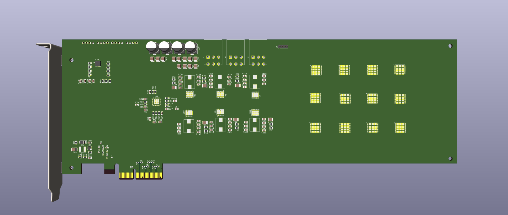
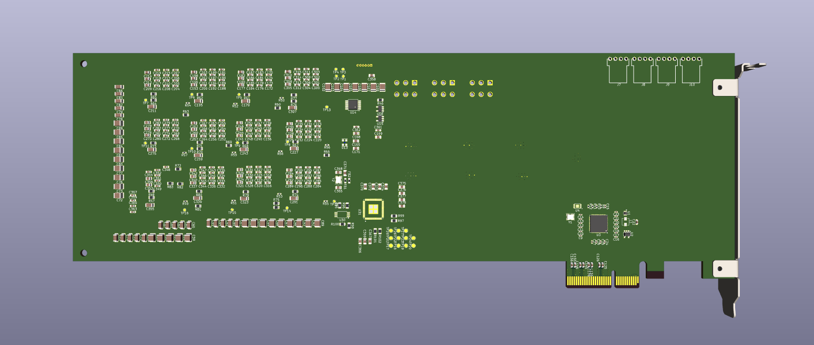

# PC-AXE: PCIe-Based Bitcoin Miner (12x BM1370, 14.4TH/s @ 200W)

**PC-AXE** is a compact, PCIe x4-based, open-hardware Bitcoin miner designed to plug directly into desktop computers. Inspired by [Bitaxe](https://github.com/skot/bitaxe), Bitcrane, and professional mining cards, PC-AXE uses twelve BM1370 ASIC chips and a 6-phase high-efficiency buck converter to deliver up to **14.4TH/s** of hashrate at just **200W** power draw.

---

  
*Top side of the PC-AXE board*

  
*Bottom side of the PC-AXE board*

---

## Features

- **Standard PCIe x4 Form Factor**
  - Easily integrates into modern desktop systems
  - Powered via PCIe slot with optional external power input

- **12 × BM1370 ASIC Chips**
  - Same chips used in Antminer S19k Pro
  - Estimated hashrate of ~1.2TH/s per chip

- **6-Phase 180A Buck Converter**
  - High-efficiency power delivery at 1.1V
  - Total power consumption approximately 200W

- **Fully Open-Source Design**
  - Includes KiCad schematics, layout, and source files
  - Planned firmware compatibility with Bitaxe ecosystem

- **UART Debug Interface**
  - Communicates via USB-to-UART bridge (e.g. FT4232H)
  - Supports daisy-chained UART control for ASICs

- **Design Inspiration**
  - Derived from Bitaxe (compact USB miner)
  - Influenced by Bitcrane (PCIe mining cards with BM1384 chips)

---

## Getting Started

### Build Instructions

1. Open the project in KiCad 7 or newer
2. Review the schematic and PCB layout
3. Export Gerber files and order the PCB from your preferred manufacturer
4. Assemble the board using the BOM (to be published)
5. Flash control firmware (currently in development)

### UART Connection

Connect an FTDI FT4232H or equivalent USB-to-UART adapter to the debug header. A single UART channel can control all 12 ASICs via a daisy-chained SPI-over-UART protocol.

---

## License

- **Hardware**: [CERN OHL-S v2.0](https://ohwr.org/project/cernohl)  
  A strongly reciprocal license requiring all derivatives to remain open-source.
- **Software**: MIT License (planned)

---

## Acknowledgments

This project draws inspiration and technical insight from several open-source mining hardware efforts:

- [Bitaxe](https://github.com/skot/bitaxe) – foundational open hardware Bitcoin miner  
- [NerdAxe](https://github.com/BitMaker-hub/NerdAxe) – compact ESP32-based BM1370 miner 
- [NerdOCTAXE-Gamma](https://github.com/5toliv/NerdOCTAXE-Gamma) – 8‑ASIC miner derived from NerdQaxe 
- [NerdEKO‑Gamma](https://github.com/phil31/NerdEKO-Gamma) – ESP32-based miner reference design   
- [Bitcrane](https://bitcointalk.org/index.php?topic=951507.0) – USB antminer control board  design

We thank these creators for their contributions to the open-source mining community.
---

## Contact / Collaboration

If you are a developer, hardware enthusiast, or miner interested in contributing to this open hardware project, feel free to open issues or pull requests. Community collaboration is welcome.

